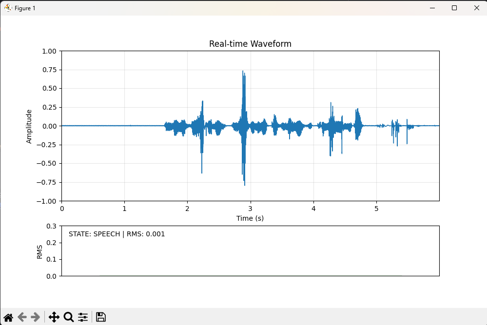

# OpenAi model whisper

---

---

- whisper?
    
    OpenAI의 **Whisper** 모델은 자동 음성 인식(ASR, Automatic Speech Recognition)과 다국어 음성 처리에 특화된 **딥러닝 기반 음성-텍스트 변환 모델**
    
    ---
    
    - **Transformer 기반 인코더-디코더 구조**
    - **68만 시간 이상**의 다국어 음성 데이터(자막 포함)로 학습
    - 모델 크기 → 모델이 작아질수록 빠르지만 정확도가 낮아짐…
        - `tiny` (39M)
        - `base` (74M)
        - `small` (244M)
        - `medium` (769M)
        - `large` (1550M)
    - Why?
        
        ---
        
        - 장점
            
            ---
            
            - 범용성 (Multilingual + Multi-task)
                - 다국어 지원, **98개 이상 언어**를 포함해 자연스럽게 인식
                - 번역까지 내장 → 음성을 바로 **영어로 번역**
            
            ---
            
            - 오픈소스 + 로컬 실행 가능
                - 클라우드 의존 없이 완전 오프라인 실행
                    - Google Speech API, Azure Speech 등은 클라우드 사용이 기본
                    - Whisper는 공개 모델을 내려받아 GPU/CPU에서 오프라인으로 실행가능
                - 상용 API 대비 무료
            
            ---
            
            - 잡음 강인성 (Noise Robustness)
                - 68만 시간 이상의 실제 유튜브/자막 데이터로 학습되어 **소음, 억양, 발화 스타일 변화**에 대한 적응력이 높다
            
            ---
            
            - 정확도 + 문맥 이해력
                - Transformer 기반 문맥 처리, 길이 제한 없음
            
            ---
            
            - 개발 친화성 & 생태계
                - Python API 간편
        
        ---
        
        - 타 API와 비교
            
            
            | 특성 | Whisper | Google Speech API | Vosk / DeepSpeech |
            | --- | --- | --- | --- |
            | 다국어 | ✅ 매우 넓음 | 제한적 | 언어별 모델 필요 |
            | 번역 | ✅ 내장 | ❌ 별도 API 필요 | ❌ |
            | 오프라인 사용 | ✅ 가능 | ❌ | ✅ 가능 |
            | 잡음 강인성 | ✅ 높음 | 중간 | 낮음 |
            | 설치/사용 편의성 | ✅ 쉬움 | API Key 필요 | 모델 빌드 필요 |
            | 실시간 최적화 | ✅ 가능(faster-whisper) | ✅ | 부분적으로 지원 |

---

---

- What
    - **faster-whisper (CTranslate2 기반, GPU/CPU 최적화)**
    - ~~WebRTC + Whisper API (OpenAI Realtime)~~
    - ~~VAD(Voice Activity Detection)와 조합해 말할 때만 캡처 → 더 자연스러운 실시간 대화 구현~~

---

---

- How
    - faster-whisper

---

---

- Development Step
    - 1. 음성녹음을 통한 stt
        
        ```python
        import whisper
        from IPython.display import Audio, display
        
        audio_path = "D:\개인\이것저것\갠프\음성인식_whisper\유상록 교수님 파일\example.wav"
        
        display(Audio(audio_path))
        
        a = input("모델 선택(tiny, base, small, medium, large)")
        model = whisper.load_model(a)
        
        result = whisper.transcribe(model)
        print(result["text"])
        ```
        
    - 2. 실시간 stt
        
        ```python
        import os
        import sys
        import time
        import queue
        import threading
        from concurrent.futures import ThreadPoolExecutor
        from collections import deque
        
        import numpy as np
        import sounddevice as sd
        import webrtcvad
        from faster_whisper import WhisperModel
        
        # ========= 환경/모델 설정 =========
        SAMPLE_RATE = 16000
        FRAME_MS = 20
        FRAME_SAMPLES = SAMPLE_RATE * FRAME_MS // 1000  # 320 samples
        CHUNK_SECONDS = 1.6
        OVERLAP_SECONDS = 0.4
        LANG = "ko"
        
        # 4070 Super 권장: int8_float16 (VRAM 5~7GB, 속도 거의 동일)
        MODEL_NAME = "large-v3"
        DEVICE = "cuda"
        COMPUTE_TYPE = "float16"  # "int8_float16"로 바꾸면 VRAM↓, 속도 거의 동일
        
        # ========= 실행 내부 상태 =========
        audio_q = queue.Queue(maxsize=64)
        decode_q = queue.Queue(maxsize=8)
        stop_flag = False
        
        # 무음 타임아웃: 말 멈춘 뒤 FINAL 확정
        SILENCE_TIMEOUT = 0.6  # 초
        
        # ========= 모델 로드 & 워밍업 =========
        model = WhisperModel(MODEL_NAME, device=DEVICE, compute_type=COMPUTE_TYPE)
        
        # Warm-up: 첫 추론 지연 제거 (0.5s 무음)
        _warm = np.zeros(int(SAMPLE_RATE * 0.5), dtype=np.float32)
        _ = list(model.transcribe(_warm, language=LANG, beam_size=1, vad_filter=False,
                                  condition_on_previous_text=False))
        
        # ========= 오디오 콜백 =========
        def audio_callback(indata, frames, time_info, status):
            if status:
                print(status, file=sys.stderr)
            # mono float32 [-1,1]
            try:
                audio_q.put_nowait(indata[:, 0].copy())
            except queue.Full:
                # 드랍 (지연 방지)
                pass
        
        # ========= 디코드 워커 (단일) =========
        def decode_worker():
            while not stop_flag:
                try:
                    segment, is_final = decode_q.get(timeout=0.1)
                except queue.Empty:
                    continue
                try:
                    segments, info = model.transcribe(
                        segment,
                        language=LANG,
                        beam_size=1,                  # 지연 최소화
                        temperature=0.0,
                        vad_filter=False,             # 외부 VAD 사용
                        condition_on_previous_text=False,
                    )
                    text = "".join([s.text for s in segments]).strip()
                    if text:
                        prefix = "[FINAL]" if is_final else "[PART ]"
                        print(prefix, text, flush=True)
                finally:
                    decode_q.task_done()
        
        # ========= VAD + 버퍼링 =========
        def vad_streamer():
            vad = webrtcvad.Vad(2)  # 0~3
            # 블록 저장용: 리스트 누적 후 한 번에 concat
            active_blocks = []
            active_len = 0  # 샘플 개수
            overlap_len = int(OVERLAP_SECONDS * SAMPLE_RATE)
            min_len = int(CHUNK_SECONDS * SAMPLE_RATE)
        
            # 오버랩 보관 (deque로 고정 길이 유지)
            tail = deque(maxlen=overlap_len)
            last_speech_time = time.time()
            silence_armed = False
        
            # 재사용 변환 버퍼(성능 미세 최적화)
            def is_speech(frame_f32: np.ndarray) -> bool:
                # float32 -> int16 without extra alloc
                f = np.clip(frame_f32 * 32768.0, -32768.0, 32767.0).astype(np.int16, copy=False)
                return vad.is_speech(f.tobytes(), SAMPLE_RATE)
        
            pending = np.zeros(0, dtype=np.float32)
        
            while not stop_flag:
                try:
                    block = audio_q.get(timeout=0.1)
                except queue.Empty:
                    block = None
        
                if block is not None:
                    pending = np.concatenate((pending, block)) if pending.size else block
        
                # 프레임 단위로 처리
                while pending.size >= FRAME_SAMPLES:
                    frame = pending[:FRAME_SAMPLES]
                    pending = pending[FRAME_SAMPLES:]
        
                    if is_speech(frame):
                        last_speech_time = time.time()
                        silence_armed = True
                        # 활성 버퍼에 축적
                        active_blocks.append(frame)
                        active_len += frame.size
                        # 길이가 충분하면 PART 디코드
                        if active_len >= min_len:
                            # segment = [tail] + active
                            if tail:
                                pre = np.frombuffer(np.array(tail, dtype=np.float32).tobytes(), dtype=np.float32)
                                segment = np.concatenate((pre, *active_blocks)) if active_blocks else pre
                            else:
                                segment = np.concatenate(active_blocks)
                            # PART 요청 (단일 워커로 직렬화)
                            try:
                                decode_q.put_nowait((segment.copy(), False))
                            except queue.Full:
                                pass
                            # tail만 남기고 초기화
                            # tail 갱신: 마지막 overlap_len 만큼
                            recent = segment[-overlap_len:] if segment.size >= overlap_len else segment
                            tail.clear()
                            tail.extend(recent.tolist())
                            active_blocks.clear()
                            active_len = 0
                    else:
                        # 무음
                        if silence_armed and (time.time() - last_speech_time) >= SILENCE_TIMEOUT:
                            # FINAL 디코드
                            if active_len > 0 or len(tail) > 0:
                                if tail and active_blocks:
                                    pre = np.frombuffer(np.array(tail, dtype=np.float32).tobytes(), dtype=np.float32)
                                    segment = np.concatenate((pre, *active_blocks))
                                elif active_blocks:
                                    segment = np.concatenate(active_blocks)
                                else:
                                    # tail만 있을 때
                                    segment = np.frombuffer(np.array(tail, dtype=np.float32).tobytes(), dtype=np.float32)
        
                                try:
                                    decode_q.put_nowait((segment.copy(), True))
                                except queue.Full:
                                    pass
        
                            # 다음 턴 대비: tail 유지, 활성 버퍼 비움
                            if segment.size >= overlap_len:
                                new_tail = segment[-overlap_len:]
                            else:
                                new_tail = segment
                            tail.clear()
                            tail.extend(new_tail.tolist())
                            active_blocks.clear()
                            active_len = 0
                            silence_armed = False
        
        # ========= 메인 =========
        def main():
            global stop_flag
            print("🎤 시작: 마이크에 대고 말하세요. (Ctrl+C 종료)")
        
            # 디코더 워커 1개 (GPU/모델 안전성)
            executor = ThreadPoolExecutor(max_workers=1)
            executor.submit(decode_worker)
        
            # 낮은 레이턴시 장치 설정 (카드/드라이버에 따라 무시될 수 있음)
            sd.default.latency = ('low', 'low')
        
            # 오디오 입력 시작
            with sd.InputStream(samplerate=SAMPLE_RATE, channels=1, dtype="float32",
                                blocksize=FRAME_SAMPLES, callback=audio_callback):
                t = threading.Thread(target=vad_streamer, daemon=True)
                t.start()
                try:
                    while True:
                        time.sleep(0.1)
                except KeyboardInterrupt:
                    stop_flag = True
                    print("\n종료 중...")
                finally:
                    # 큐 비우고 워커 종료 대기
                    time.sleep(0.2)
                    executor.shutdown(wait=False)
        
        if __name__ == "__main__":
            # 필요 시 OMP 중복 임시 우회(테스트용). 근본 해결은 충돌 패키지 정리.
            # os.environ["KMP_DUPLICATE_LIB_OK"] = "TRUE"
            main()
        
        ```
        
    - 3. 서버모델 → 로컬로 전환
        
        ```python
        # realtime_whisper_stream.py
        import os
        import sys
        import time
        import queue
        import threading
        from concurrent.futures import ThreadPoolExecutor
        from collections import deque
        
        import numpy as np
        import sounddevice as sd
        import webrtcvad
        from faster_whisper import WhisperModel
        
        # ===================== 사용자 설정 구역 =====================
        SAMPLE_RATE       = 16000
        FRAME_MS          = 20                                 # 20ms 프레임
        CHUNK_SECONDS     = 0.8                                # PART 최소 길이
        OVERLAP_SECONDS   = 0.35                               # 경계 보정
        EMIT_INTERVAL     = 0.30                               # PART 방출 주기(초)
        MAX_ACTIVE_SECONDS= 2.0                                # 활성 발화 상한(너무 길어지지 않도록)
        SILENCE_TIMEOUT   = 0.5                                # 무음 지속 뒤 FINAL 확정
        LANG              = "ko"                               # "ko" or "en" 등
        
        # 모델 소스 선택: "local" 또는 "hub"
        MODEL_SOURCE      = "local"                            # "local" | "hub"
        # 1) 로컬 경로로 쓸 때 (위에서 받아둔 폴더)
        LOCAL_MODEL_DIR   = r"D:\models\faster-whisper-large-v3"   # 또는 v3-turbo 폴더
        # 2) 허깅페이스 모델명으로 쓸 때
        HUB_MODEL_NAME    = "Systran/faster-whisper-large-v3"      # 또는 "Systran/faster-whisper-large-v3-turbo"
        # 허깅페이스 캐시 디렉토리(선택). None이면 기본 사용자 캐시 사용
        HF_CACHE_DIR      = None  # 예: r"D:\hf_cache"
        LOCAL_ONLY        = True  # True면 오프라인(캐시/로컬만) 사용
        
        # 디바이스/정밀도 기본값 (4070 Super 권장값)
        PREFER_FLOAT16    = True   # True면 float16, False면 int8_float16
        # ===========================================================
        
        FRAME_SAMPLES = SAMPLE_RATE * FRAME_MS // 1000  # 320 samples
        audio_q = queue.Queue(maxsize=64)
        decode_q = queue.Queue(maxsize=8)
        stop_flag = False
        
        def pick_device_and_compute():
            """CUDA 가능 여부에 따라 device/compute_type 자동 선정."""
            device = "cpu"
            compute_type = "int8"
            try:
                import torch
                if torch.cuda.is_available():
                    device = "cuda"
                    compute_type = "float16" if PREFER_FLOAT16 else "int8_float16"
                else:
                    # CPU에서는 int8가 대체로 빠름
                    compute_type = "int8"
            except Exception:
                # torch 없는 환경이면 faster-whisper의 ctranslate2가 알아서 CPU 사용
                device = "cpu"
                compute_type = "int8"
            return device, compute_type
        
        def load_model():
            device, compute_type = pick_device_and_compute()
            print(f"[INFO] Device={device}, compute_type={compute_type}")
        
            if MODEL_SOURCE == "local":
                model_path = LOCAL_MODEL_DIR
            else:
                model_path = HUB_MODEL_NAME
        
            kwargs = dict(device=device, compute_type=compute_type)
            # 허깅페이스 캐시/오프라인 설정
            if HF_CACHE_DIR:
                kwargs["cache_directory"] = HF_CACHE_DIR
            if LOCAL_ONLY:
                kwargs["local_files_only"] = True
        
            model = WhisperModel(model_path, **kwargs)
        
            # Warm-up: 첫 추론 지연 제거
            _warm = np.zeros(int(SAMPLE_RATE * 0.5), dtype=np.float32)
            _ = list(model.transcribe(_warm, language=LANG, beam_size=1, vad_filter=False,
                                      condition_on_previous_text=False))
            return model
        
        def audio_callback(indata, frames, time_info, status):
            if status:
                print(status, file=sys.stderr)
            try:
                audio_q.put_nowait(indata[:, 0].copy())  # mono float32
            except queue.Full:
                pass  # 드랍(지연 방지)
        
        def decode_worker(model: WhisperModel):
            while not stop_flag:
                try:
                    segment, is_final = decode_q.get(timeout=0.1)
                except queue.Empty:
                    continue
                try:
                    segments, info = model.transcribe(
                        segment,
                        language=LANG,
                        beam_size=1,                  # 지연 최소화
                        temperature=0.0,
                        vad_filter=False,             # 외부 VAD 사용
                        condition_on_previous_text=False,
                    )
                    text = "".join([s.text for s in segments]).strip()
                    if text:
                        prefix = "[FINAL]" if is_final else "[PART ]"
                        print(prefix, text, flush=True)
                finally:
                    decode_q.task_done()
        
        def vad_streamer():
            vad = webrtcvad.Vad(2)  # 0~3 (소음 많으면 3)
            overlap_len = int(OVERLAP_SECONDS * SAMPLE_RATE)
            min_len     = int(CHUNK_SECONDS * SAMPLE_RATE)
            max_active  = int(MAX_ACTIVE_SECONDS * SAMPLE_RATE)
        
            # 누적 버퍼들
            pending = np.zeros(0, dtype=np.float32)  # 녹음 큐에서 올라온 원시 블록
            active  = np.zeros(0, dtype=np.float32)  # 현재 발화 누적
            tail    = np.zeros(0, dtype=np.float32)  # 오버랩 유지
        
            last_emit_ts   = 0.0
            last_speech_ts = 0.0
            silence_armed  = False
        
            def is_speech(frame_f32: np.ndarray) -> bool:
                f = np.clip(frame_f32 * 32768.0, -32768.0, 32767.0).astype(np.int16, copy=False)
                return vad.is_speech(f.tobytes(), SAMPLE_RATE)
        
            while not stop_flag:
                # 오디오 블록 수집
                try:
                    block = audio_q.get(timeout=0.1)
                    pending = np.concatenate((pending, block)) if pending.size else block
                except queue.Empty:
                    block = None
        
                # 20ms 단위로 처리
                while pending.size >= FRAME_SAMPLES:
                    frame = pending[:FRAME_SAMPLES]
                    pending = pending[FRAME_SAMPLES:]
        
                    if is_speech(frame):
                        silence_armed = True
                        last_speech_ts = time.time()
        
                        # 활성 발화 누적 (상한 유지)
                        if active.size == 0:
                            active = frame
                        else:
                            active = np.concatenate((active, frame))
                            if active.size > max_active:
                                active = active[-max_active:]
        
                        # 충분히 모였고, 방출 주기가 지났다면 PART 방출
                        if active.size >= min_len and (time.time() - last_emit_ts) >= EMIT_INTERVAL:
                            segment = np.concatenate((tail, active)) if tail.size else active.copy()
                            try:
                                decode_q.put_nowait((segment, False))  # PART
                                last_emit_ts = time.time()
                            except queue.Full:
                                pass
        
                            # tail 갱신
                            tail = segment[-overlap_len:] if segment.size >= overlap_len else segment.copy()
        
                    else:
                        # 무음: 일정 시간 지속 시 FINAL 확정
                        if silence_armed and (time.time() - last_speech_ts) >= SILENCE_TIMEOUT:
                            if active.size > 0 or tail.size > 0:
                                segment = np.concatenate((tail, active)) if (tail.size and active.size) else (active if active.size else tail)
                                try:
                                    decode_q.put_nowait((segment, True))  # FINAL
                                except queue.Full:
                                    pass
                                # 다음 턴 대비 tail만 유지
                                tail = segment[-overlap_len:] if segment.size >= overlap_len else segment.copy()
                                active = np.zeros(0, dtype=np.float32)
                            silence_armed = False
        
        def main():
            global stop_flag
            print("🎤 시작: 말하는 동안 [PART]가 연속 출력되고, 멈추면 [FINAL]로 확정됩니다. (Ctrl+C 종료)")
        
            # 디바이스 레이턴시 힌트
            sd.default.latency = ('low', 'low')
        
            # 모델 로드
            model = load_model()
        
            # 단일 디코딩 워커 (순서/안정성)
            executor = ThreadPoolExecutor(max_workers=1)
            executor.submit(decode_worker, model)
        
            # 오디오 입력 시작
            with sd.InputStream(samplerate=SAMPLE_RATE, channels=1, dtype="float32",
                                blocksize=FRAME_SAMPLES, callback=audio_callback):
                t = threading.Thread(target=vad_streamer, daemon=True)
                t.start()
                try:
                    while True:
                        time.sleep(0.1)
                except KeyboardInterrupt:
                    stop_flag = True
                    print("\n종료 중...")
                finally:
                    time.sleep(0.2)
                    executor.shutdown(wait=False)
        
        if __name__ == "__main__":
            # 필요 시 테스트용 임시 우회 (OMP 중복 경고 무시) — 근본 해결은 충돌 패키지 정리
            # os.environ["KMP_DUPLICATE_LIB_OK"] = "TRUE"
            main()
        
        ```
        
    - 4. 정확도 향상 & 속도 증강
        
        ```python
        # realtime_whisper_final_only_hiacc.py
        import os
        import sys
        import time
        import queue
        import threading
        from concurrent.futures import ThreadPoolExecutor
        
        import numpy as np
        import sounddevice as sd
        import webrtcvad
        from faster_whisper import WhisperModel
        
        # ===================== 사용자 설정 =====================
        SAMPLE_RATE         = 16000
        FRAME_MS            = 20                                   # 20ms VAD 프레임
        CHUNK_SECONDS       = 1.6                                  # 최소 발화 길이
        OVERLAP_SECONDS     = 0.50                                  # 경계 보정 ↑
        SILENCE_TIMEOUT     = 0.80                                  # 무음 지속 뒤 확정 ↑
        MAX_ACTIVE_SECONDS  = 12.0
        LANG                = "ko"                                  # "ko", "en", ...
        
        # 모델 소스: "local" 또는 "hub"
        MODEL_SOURCE        = "local"                               # "local" | "hub"
        LOCAL_MODEL_DIR     = r"D:\개인\이것저것\갠프\음성인식_whisper\whisper_large"  # 로컬 모델 폴더
        HUB_MODEL_NAME      = "Systran/faster-whisper-large-v3"     # 허깅페이스 모델명
        HF_CACHE_DIR        = None                                  # 예: r"D:\hf_cache"
        LOCAL_ONLY          = True                                   # 오프라인/캐시만 사용
        
        # 디바이스/정밀도(4070 Super 권장)
        PREFER_FLOAT16      = True   # True: float16, False: int8_float16
        
        # ===== 정확도 옵션 =====
        BEAM_SIZE           = 5       # 4~6 권장(정확도↑, 지연 약간↑)
        PATIENCE            = 1.0     # beam 후보 관용도
        INITIAL_GUIDE       = "한국어로 자연스럽게 띄어쓰고 구두점을 사용해 주세요."
        CONTEXT_CHARS       = 120     # 이전 문맥 유지 길이(너무 길면 지연↑)
        # =======================================================
        
        FRAME_SAMPLES        = SAMPLE_RATE * FRAME_MS // 1000
        OVERLAP_SAMPLES      = int(OVERLAP_SECONDS * SAMPLE_RATE)
        MIN_SAMPLES          = int(CHUNK_SECONDS * SAMPLE_RATE)
        MAX_ACTIVE_SAMPLES   = int(MAX_ACTIVE_SECONDS * SAMPLE_RATE)
        
        audio_q  = queue.Queue(maxsize=64)
        decode_q = queue.Queue(maxsize=8)
        stop_flag = False
        prev_context = ""  # 확정 문장의 말미를 보관해 다음 추론에 힌트로 제공
        
        def pick_device_and_compute():
            device = "cpu"; compute_type = "int8"
            try:
                import torch
                if torch.cuda.is_available():
                    device = "cuda"
                    compute_type = "float16" if PREFER_FLOAT16 else "int8_float16"
                else:
                    compute_type = "int8"
            except Exception:
                device = "cpu"; compute_type = "int8"
            return device, compute_type
        
        def load_model():
            device, compute_type = pick_device_and_compute()
            print(f"[INFO] Device={device}, compute_type={compute_type}")
        
            src = LOCAL_MODEL_DIR if MODEL_SOURCE == "local" else HUB_MODEL_NAME
            kwargs = dict(device=device, compute_type=compute_type)
            if HF_CACHE_DIR: kwargs["cache_directory"] = HF_CACHE_DIR
            if LOCAL_ONLY:   kwargs["local_files_only"] = True
        
            model = WhisperModel(src, **kwargs)
        
            # Warm-up: 첫 추론 지연 제거
            _warm = np.zeros(int(SAMPLE_RATE * 0.5), dtype=np.float32)
            _ = list(model.transcribe(_warm, language=LANG, beam_size=1,
                                      vad_filter=False, condition_on_previous_text=False))
            return model
        
        def audio_callback(indata, frames, time_info, status):
            if status: print(status, file=sys.stderr)
            try:
                audio_q.put_nowait(indata[:, 0].copy())  # mono float32
            except queue.Full:
                pass  # 지연 방지
        
        def decode_worker(model: WhisperModel):
            global prev_context
            while not stop_flag:
                try:
                    segment = decode_q.get(timeout=0.1)
                except queue.Empty:
                    continue
                try:
                    segments, info = model.transcribe(
                        segment,
                        language=LANG,
                        beam_size=BEAM_SIZE,
                        patience=PATIENCE,
                        temperature=0.0,
                        vad_filter=False,                 # 외부 VAD 사용
                        condition_on_previous_text=True,  # 이전 문맥 활용
                        initial_prompt=(prev_context + " " + INITIAL_GUIDE).strip()
                    )
                    text = "".join([s.text for s in segments]).strip()
                    if text:
                        print(text, flush=True)           # ★ FINAL만 출력
                        # 다음 턴을 위한 문맥 업데이트(뒤쪽만 유지)
                        joined = (prev_context + " " + text).strip()
                        prev_context = joined[-CONTEXT_CHARS:]
                finally:
                    decode_q.task_done()
        
        def vad_streamer():
            """무음 지속 시 최종 문장(FINAL)으로만 디코딩."""
            vad = webrtcvad.Vad(1)  # 0~3, 낮을수록 덜 공격적(잘림 방지)
            pending = np.zeros(0, dtype=np.float32)
            active  = np.zeros(0, dtype=np.float32)
            tail    = np.zeros(0, dtype=np.float32)
        
            last_speech_ts = 0.0
            silence_armed  = False
        
            def is_speech(frame_f32: np.ndarray) -> bool:
                f = np.clip(frame_f32 * 32768.0, -32768.0, 32767.0).astype(np.int16, copy=False)
                return vad.is_speech(f.tobytes(), SAMPLE_RATE)
        
            while not stop_flag:
                # 큐에서 원시 오디오 블록 수집
                try:
                    block = audio_q.get(timeout=0.1)
                    pending = np.concatenate((pending, block)) if pending.size else block
                except queue.Empty:
                    block = None
        
                # 20ms 프레임 단위 처리
                while pending.size >= FRAME_SAMPLES:
                    frame = pending[:FRAME_SAMPLES]
                    pending = pending[FRAME_SAMPLES:]
        
                    if is_speech(frame):
                        silence_armed = True
                        last_speech_ts = time.time()
                        active = frame if active.size == 0 else np.concatenate((active, frame))
        
                        # 너무 길어지면 강제 확정(FINAL)하고 초기화
                        if active.size > MAX_ACTIVE_SAMPLES:
                            segment = np.concatenate((tail, active)) if tail.size else active.copy()
                            try:
                                decode_q.put_nowait(segment)
                            except queue.Full:
                                pass
                            tail = segment[-OVERLAP_SAMPLES:] if segment.size >= OVERLAP_SAMPLES else segment.copy()
                            active = np.zeros(0, dtype=np.float32)
                            silence_armed = False
        
                    else:
                        # 무음이 일정 시간 지속되면 문장 종료로 판단
                        if silence_armed and (time.time() - last_speech_ts) >= SILENCE_TIMEOUT:
                            if active.size >= MIN_SAMPLES or (tail.size + active.size) >= MIN_SAMPLES:
                                segment = np.concatenate((tail, active)) if tail.size else active.copy()
                                try:
                                    decode_q.put_nowait(segment)
                                except queue.Full:
                                    pass
                                tail = segment[-OVERLAP_SAMPLES:] if segment.size >= OVERLAP_SAMPLES else segment.copy()
                            active = np.zeros(0, dtype=np.float32)
                            silence_armed = False
        
        def main():
            global stop_flag
            print("🎤 시작: 말이 끝나면 한 번에 출력됩니다. (정확도 강화 설정)  Ctrl+C 종료")
        
            sd.default.latency = ('low', 'low')  # 레이턴시 힌트
        
            model = load_model()
        
            # 단일 디코딩 워커(순서/안정성)
            executor = ThreadPoolExecutor(max_workers=1)
            executor.submit(decode_worker, model)
        
            with sd.InputStream(samplerate=SAMPLE_RATE, channels=1, dtype="float32",
                                blocksize=FRAME_SAMPLES, callback=audio_callback):
                t = threading.Thread(target=vad_streamer, daemon=True)
                t.start()
                try:
                    while True:
                        time.sleep(0.1)
                except KeyboardInterrupt:
                    stop_flag = True
                    print("\n종료 중...")
                finally:
                    time.sleep(0.2)
                    executor.shutdown(wait=False)
        
        if __name__ == "__main__":
            # 필요시 테스트용: OMP 중복 경고 임시 우회 (근본 해결은 충돌 패키지 정리)
            # os.environ["KMP_DUPLICATE_LIB_OK"] = "TRUE"
            main()
        
        ```
        
    - 5. 마이크 입력 시각화(입력이 되는건지 안되는건지 확인하기 위해)
        - 코드
            
            ```python
            # realtime_whisper_final_only_hiacc_vis_nohangul.py
            # ==========================================================
            # 실시간 음성 인식(Whisper, 고정확 옵션) + 실시간 시각화(Matplotlib)
            # - 그래프에는 한글을 전혀 사용하지 않음 (폰트 경고 방지)
            # - 콘솔에만 [FINAL] 한글 출력
            # ==========================================================
            
            import sys
            import time
            import queue
            import threading
            from concurrent.futures import ThreadPoolExecutor
            from collections import deque
            
            import numpy as np
            import sounddevice as sd
            import webrtcvad
            import matplotlib
            matplotlib.use("TkAgg")  # Tkinter backend
            import matplotlib.pyplot as plt
            
            from faster_whisper import WhisperModel
            
            # ===================== User Config =====================
            SAMPLE_RATE         = 16000
            FRAME_MS            = 20
            CHUNK_SECONDS       = 1.6
            OVERLAP_SECONDS     = 0.50
            SILENCE_TIMEOUT     = 0.80
            MAX_ACTIVE_SECONDS  = 12.0
            LANG                = "ko"   # 인식 언어 (Whisper용, 콘솔 출력만)
            
            MODEL_SOURCE        = "local"
            LOCAL_MODEL_DIR     = r"D:\개인\이것저것\갠프\음성인식_whisper\whisper_large"
            HUB_MODEL_NAME      = "Systran/faster-whisper-large-v3"
            HF_CACHE_DIR        = None
            LOCAL_ONLY          = True
            
            PREFER_FLOAT16      = True
            BEAM_SIZE           = 5
            PATIENCE            = 1.0
            INITIAL_GUIDE       = "한국어로 자연스럽게 띄어쓰고 구두점을 사용해 주세요."
            CONTEXT_CHARS       = 120
            
            # ===================== Derived =====================
            FRAME_SAMPLES        = SAMPLE_RATE * FRAME_MS // 1000
            OVERLAP_SAMPLES      = int(OVERLAP_SECONDS * SAMPLE_RATE)
            MIN_SAMPLES          = int(CHUNK_SECONDS * SAMPLE_RATE)
            MAX_ACTIVE_SAMPLES   = int(MAX_ACTIVE_SECONDS * SAMPLE_RATE)
            
            audio_q   = queue.Queue(maxsize=64)
            decode_q  = queue.Queue(maxsize=8)
            stop_flag = False
            prev_context = ""
            
            class VisualState:
                def __init__(self, wave_seconds=6.0):
                    self.lock = threading.Lock()
                    self.wave_buf = deque(maxlen=int(SAMPLE_RATE * wave_seconds))
                    self.rms = 0.0
                    self.is_speech = False
            
            vis = VisualState(wave_seconds=6.0)
            
            # --------------------------------------
            # Model
            # --------------------------------------
            def pick_device_and_compute():
                device = "cpu"; compute_type = "int8"
                try:
                    import torch
                    if torch.cuda.is_available():
                        device = "cuda"
                        compute_type = "float16" if PREFER_FLOAT16 else "int8_float16"
                except:
                    pass
                return device, compute_type
            
            def load_model():
                device, compute_type = pick_device_and_compute()
                print(f"[INFO] Device={device}, compute_type={compute_type}")
                src = LOCAL_MODEL_DIR if MODEL_SOURCE == "local" else HUB_MODEL_NAME
                kwargs = dict(device=device, compute_type=compute_type)
                if HF_CACHE_DIR: kwargs["cache_directory"] = HF_CACHE_DIR
                if LOCAL_ONLY:   kwargs["local_files_only"] = True
                model = WhisperModel(src, **kwargs)
                # warm-up
                _warm = np.zeros(int(SAMPLE_RATE * 0.3), dtype=np.float32)
                _ = list(model.transcribe(_warm, language=LANG, beam_size=1,
                                          vad_filter=False, condition_on_previous_text=False))
                return model
            
            # --------------------------------------
            # Audio callback
            # --------------------------------------
            def audio_callback(indata, frames, time_info, status):
                if status:
                    print(status, file=sys.stderr)
                try:
                    audio_q.put_nowait(indata[:, 0].copy())
                except queue.Full:
                    pass
            
            # --------------------------------------
            # Decoder worker
            # --------------------------------------
            def decode_worker(model: WhisperModel):
                global prev_context
                while not stop_flag:
                    try:
                        segment = decode_q.get(timeout=0.1)
                    except queue.Empty:
                        continue
                    try:
                        segments, info = model.transcribe(
                            segment,
                            language=LANG,
                            beam_size=BEAM_SIZE,
                            patience=PATIENCE,
                            temperature=0.0,
                            vad_filter=False,
                            condition_on_previous_text=True,
                            initial_prompt=(prev_context + " " + INITIAL_GUIDE).strip()
                        )
                        text = "".join([s.text for s in segments]).strip()
                        if text:
                            print(f"[FINAL] {text}", flush=True)
                            joined = (prev_context + " " + text).strip()
                            prev_context = joined[-CONTEXT_CHARS:]
                    finally:
                        decode_q.task_done()
            
            # --------------------------------------
            # VAD streaming
            # --------------------------------------
            def vad_streamer():
                vad = webrtcvad.Vad(1)
                pending = np.zeros(0, dtype=np.float32)
                active  = np.zeros(0, dtype=np.float32)
                tail    = np.zeros(0, dtype=np.float32)
            
                last_speech_ts = 0.0
                silence_armed  = False
            
                def is_speech(frame):
                    f = np.clip(frame * 32768.0, -32768.0, 32767.0).astype(np.int16)
                    return vad.is_speech(f.tobytes(), SAMPLE_RATE)
            
                while not stop_flag:
                    try:
                        block = audio_q.get(timeout=0.1)
                        with vis.lock:
                            vis.wave_buf.extend(block.tolist())
                            vis.rms = float(np.sqrt(np.mean(np.square(block))) if block.size else 0.0)
                    except queue.Empty:
                        block = None
            
                    if block is not None:
                        pending = np.concatenate((pending, block)) if pending.size else block
            
                    while pending.size >= FRAME_SAMPLES:
                        frame = pending[:FRAME_SAMPLES]
                        pending = pending[FRAME_SAMPLES:]
            
                        speech_flag = is_speech(frame)
                        now = time.time()
            
                        if speech_flag:
                            with vis.lock:
                                vis.is_speech = True
                            silence_armed = True
                            last_speech_ts = now
                            active = frame if active.size == 0 else np.concatenate((active, frame))
            
                            if active.size > MAX_ACTIVE_SAMPLES:
                                segment = np.concatenate((tail, active)) if tail.size else active.copy()
                                try: decode_q.put_nowait(segment)
                                except queue.Full: pass
                                tail = segment[-OVERLAP_SAMPLES:] if segment.size >= OVERLAP_SAMPLES else segment.copy()
                                active = np.zeros(0, dtype=np.float32)
                                silence_armed = False
                                with vis.lock:
                                    vis.is_speech = False
                        else:
                            if silence_armed and (now - last_speech_ts) >= SILENCE_TIMEOUT:
                                if active.size >= MIN_SAMPLES:
                                    segment = np.concatenate((tail, active)) if tail.size else active.copy()
                                    try: decode_q.put_nowait(segment)
                                    except queue.Full: pass
                                    tail = segment[-OVERLAP_SAMPLES:] if segment.size >= OVERLAP_SAMPLES else segment.copy()
                                active = np.zeros(0, dtype=np.float32)
                                silence_armed = False
                                with vis.lock:
                                    vis.is_speech = False
            
            # --------------------------------------
            # Visualization
            # --------------------------------------
            def start_visualization():
                fig = plt.figure(figsize=(10, 6))
                gs = fig.add_gridspec(2, 1, height_ratios=[3, 1], hspace=0.25)
                ax_wave = fig.add_subplot(gs[0, 0])
                ax_lvl  = fig.add_subplot(gs[1, 0])
            
                x_wave = np.arange(vis.wave_buf.maxlen) / SAMPLE_RATE
                y_wave = np.zeros(vis.wave_buf.maxlen)
                (line_wave,) = ax_wave.plot(x_wave, y_wave, lw=1.0)
                ax_wave.set_title("Real-time Waveform")
                ax_wave.set_xlabel("Time (s)")
                ax_wave.set_ylabel("Amplitude")
                ax_wave.set_ylim(-1.0, 1.0)
                ax_wave.set_xlim(x_wave[0], x_wave[-1])
                ax_wave.grid(True, alpha=0.3)
            
                lvl_bar = ax_lvl.bar([0], [0.0])[0]
                ax_lvl.set_ylim(0, 0.3)
                ax_lvl.set_xlim(-0.5, 0.5)
                ax_lvl.set_xticks([])
                ax_lvl.set_ylabel("RMS")
                txt_status = ax_lvl.text(0.02, 0.9, "STATE: ...", transform=ax_lvl.transAxes, va='top')
            
                def update_once():
                    with vis.lock:
                        buf_list = list(vis.wave_buf)
                        rms = vis.rms
                        is_sp = vis.is_speech
            
                    N = len(buf_list)
                    if N < vis.wave_buf.maxlen:
                        y = np.zeros(vis.wave_buf.maxlen)
                        if N > 0:
                            y[-N:] = np.array(buf_list)
                    else:
                        y = np.array(buf_list[-vis.wave_buf.maxlen:])
            
                    line_wave.set_ydata(y)
            
                    lvl_bar.set_height(rms)
                    txt_status.set_text(f"STATE: {'SPEECH' if is_sp else 'SILENCE'} | RMS: {rms:.3f}")
                    lvl_bar.set_color("#2ca02c" if is_sp else "#1f77b4")
            
                timer = fig.canvas.new_timer(interval=33)
                def on_timer(*args, **kwargs):
                    update_once()
                    fig.canvas.draw_idle()
                timer.add_callback(on_timer)
                timer.start()
                plt.show()
            
            # --------------------------------------
            # Main
            # --------------------------------------
            def main():
                global stop_flag
                print("마이크에 말을 해주세요.")
            
                sd.default.latency = ('low', 'low')
                model = load_model()
                executor = ThreadPoolExecutor(max_workers=1)
                executor.submit(decode_worker, model)
            
                stream = sd.InputStream(samplerate=SAMPLE_RATE, channels=1, dtype="float32",
                                        blocksize=FRAME_SAMPLES, callback=audio_callback)
                stream.start()
            
                t_vad = threading.Thread(target=vad_streamer, daemon=True)
                t_vad.start()
            
                try:
                    start_visualization()
                except KeyboardInterrupt:
                    pass
                finally:
                    stop_flag = True
                    time.sleep(0.2)
                    try:
                        stream.stop(); stream.close()
                    except: pass
                    executor.shutdown(wait=False)
                    print("\n종료중.")
            
            if __name__ == "__main__":
                main()
            
            ```
            
        - 사진, 영상
            
            
            
            [1000010133.mp4](1000010133.mp4)
            

---

---

- Problem
    - 직접 겪은 문제
        
        whisper모델은 공식적으로 3.13.x 지원하지않음  
        
        →  3.10. x ~ 3.11.x 에서 사용
        
        ---
        
        특정 단어를 잘 알아먹지 못함 ex) 우로 → 위로, 오로
        
        →  테스트를 더 해봐야 할 것 같음 한번씩 우로 → 우측으로 등의 잘못 받아들이는 경우가 있긴 하나 결과는 좋으니 좋은게 좋은거지 라는 생각이 있음….
        
        ---
        
        tiny, base 모델은 쓰지말자 속도는 매우 빠르나 정확도가 굉장히 떨어짐
        
        large모델이 성능상 좋긴 하다만 매우 오래걸림  
        
        
        
              → 실시간 운용에서는 이렇게까지 걸리지 않음
        
        → GPU사용시 속도 상승
        
        ---
        
        실시간 작동시 정확도가 조금 떨어지는 경향이 있음 
        
        → 이유는 모르겠으나 파이참이나 vs코드가 아닌 cmd로 실행시 정확도가 올라감
        
    
    ---
    
    - 기타 문제
        
        ---
        
        - **실시간 지연 (Latency)**
            - CPU만 사용할 경우 **실시간 처리 속도가 느림** (특히 medium/large 모델)
            - GPU 사용, 모델 크기 축소(tiny/base), INT8 변환 등으로 보완 필요
        
        ---
        
        - **모델 크기와 자원 요구**
            - large 모델 1.5B 파라미터 → GPU 메모리 최소 8GB 이상 권장
            - 임베디드/저사양 장치에는 부담
        
        ---
        
        - **언어별 편차**
            - 영어에 최적화 → 비주류 언어는 WER이 상대적으로 높을 수 있음
            - 한국어도 좋지만 Google STT 등 클라우드가 일부 상황에서 더 나을 수 있음
                
                
                | 상황 | Whisper | Google STT 등 클라우드 |
                | --- | --- | --- |
                | 저지연 실시간 | ❌ (딜레이 있음) | ✅ 빠른 반응 |
                | 저사양/모바일 | ❌ 무겁고 느림 | ✅ 클라우드 처리 |
                | 방언/전문 용어 | △ 일반적 | ✅ 지역/분야 특화 |
                | 초장시간 오디오 | △ 리소스 부담 | ✅ 안정적 처리 |
                | 최신 용어 반영 | ❌ 업데이트 드묾 | ✅ 지속 업데이트 |
        
        ---
        
        - **발화자 분리(Speaker Diarization) 없음**
            - 기본 모델은 단일 음성 전사 전용 → 화자 분리 기능 필요하면 pyannote.audio 등과 연동해야 함
        
        ---
        
        - **모델 업데이트 빈도 낮음**
            - OpenAI가 Whisper를 자주 개선하지 않음 (커뮤니티 포크/최적화 버전 사용 권장)
        
        ---
        
        - **네트워크로 직접 스트리밍 지원 X**
            - Realtime API 이전의 오픈소스 Whisper는 WebRTC/Socket 같은 실시간 통신은 직접 구현해야 함
        
        ---
        
        - Ubuntu(Linux)환경에서 사용 가능한가?
            - 가능은 하나 Ubuntu환경에서 마이크 인식을 위한 드라이버를 따로 설치하는등의 과정이 필요 → 번거롭다.
                - 윈도우 환경에서 stt후 텍스트만 네트워크를 통해 넘긴다.
                - stt이후 모든 과정까지 전부 윈도우로 해결한 뒤 Ubuntu로 넘긴다.

---

---

- Ubuntu
    - code
        
        ```python
        import sys
        import time
        import queue
        import threading
        from concurrent.futures import ThreadPoolExecutor
        import numpy as np
        import sounddevice as sd
        import webrtcvad
        from faster_whisper import WhisperModel
        
        # ===================== User Config =====================
        SAMPLE_RATE         = 16000
        FRAME_MS            = 20
        CHUNK_SECONDS       = 1.6
        OVERLAP_SECONDS     = 0.50
        SILENCE_TIMEOUT     = 0.80
        MAX_ACTIVE_SECONDS  = 12.0
        LANG                = "ko"
        
        MODEL_SOURCE        = "local"
        LOCAL_MODEL_DIR     = "/home/cheeks/개인프로젝트/갠프/음성인식_whisper/whisper_large"
        HUB_MODEL_NAME      = "Systran/faster-whisper-large-v3"
        HF_CACHE_DIR        = None
        LOCAL_ONLY          = True
        
        PREFER_FLOAT16      = True
        BEAM_SIZE           = 5
        PATIENCE            = 1.0
        INITIAL_GUIDE       = "한국어로 자연스럽게 띄어쓰고 구두점을 사용해 주세요."
        CONTEXT_CHARS       = 120
        
        # ===================== Derived =====================
        FRAME_SAMPLES        = SAMPLE_RATE * FRAME_MS // 1000
        OVERLAP_SAMPLES      = int(OVERLAP_SECONDS * SAMPLE_RATE)
        MIN_SAMPLES          = int(CHUNK_SECONDS * SAMPLE_RATE)
        MAX_ACTIVE_SAMPLES   = int(MAX_ACTIVE_SECONDS * SAMPLE_RATE)
        
        audio_q   = queue.Queue(maxsize=64)
        decode_q  = queue.Queue(maxsize=8)
        stop_flag = False
        prev_context = ""
        
        # --------------------------------------
        # Model
        # --------------------------------------
        def pick_device_and_compute():
            """GPU 사용 여부 확인"""
            device = "cpu"; compute_type = "int8"
            try:
                import torch
                if torch.cuda.is_available():
                    device = "cuda"
                    compute_type = "float16" if PREFER_FLOAT16 else "int8_float16"
            except Exception as e:
                print("[WARN] Torch CUDA detection failed:", e)
            print(f"[INFO] Device={device}, compute_type={compute_type}")
            return device, compute_type
        
        def load_model():
            """Whisper 모델 로드"""
            device, compute_type = pick_device_and_compute()
            src = LOCAL_MODEL_DIR if MODEL_SOURCE == "local" else HUB_MODEL_NAME
            kwargs = dict(device=device, compute_type=compute_type)
            if HF_CACHE_DIR:
                kwargs["cache_directory"] = HF_CACHE_DIR
            if LOCAL_ONLY:
                kwargs["local_files_only"] = True
        
            print(f"[INFO] Loading Whisper model from: {src}")
            model = WhisperModel(src, **kwargs)
        
            # Warm-up (GPU 초기 활성화)
            _warm = np.zeros(int(SAMPLE_RATE * 0.3), dtype=np.float32)
            _ = list(model.transcribe(_warm, language=LANG, beam_size=1,
                                      vad_filter=False, condition_on_previous_text=False))
            print("[INFO] Model ready on GPU.")
            return model
        
        # --------------------------------------
        # Audio callback
        # --------------------------------------
        def audio_callback(indata, frames, time_info, status):
            if status:
                print(status, file=sys.stderr)
            try:
                audio_q.put_nowait(indata[:, 0].copy())
            except queue.Full:
                pass
        
        # --------------------------------------
        # Decoder worker
        # --------------------------------------
        def decode_worker(model: WhisperModel):
            """Whisper 디코딩 스레드"""
            global prev_context
            while not stop_flag:
                try:
                    segment = decode_q.get(timeout=0.1)
                except queue.Empty:
                    continue
                try:
                    segments, info = model.transcribe(
                        segment,
                        language=LANG,
                        beam_size=BEAM_SIZE,
                        patience=PATIENCE,
                        temperature=0.0,
                        vad_filter=False,
                        condition_on_previous_text=True,
                        initial_prompt=(prev_context + " " + INITIAL_GUIDE).strip()
                    )
                    text = "".join([s.text for s in segments]).strip()
                    if text:
                        print(f"[FINAL] {text}", flush=True)
                        joined = (prev_context + " " + text).strip()
                        prev_context = joined[-CONTEXT_CHARS:]
                finally:
                    decode_q.task_done()
        
        # --------------------------------------
        # VAD streaming
        # --------------------------------------
        def vad_streamer():
            """Voice Activity Detection 기반 스트리밍"""
            vad = webrtcvad.Vad(1)
            pending = np.zeros(0, dtype=np.float32)
            active  = np.zeros(0, dtype=np.float32)
            tail    = np.zeros(0, dtype=np.float32)
            last_speech_ts = 0.0
            silence_armed  = False
        
            def is_speech(frame):
                f = np.clip(frame * 32768.0, -32768.0, 32767.0).astype(np.int16)
                return vad.is_speech(f.tobytes(), SAMPLE_RATE)
        
            while not stop_flag:
                try:
                    block = audio_q.get(timeout=0.1)
                except queue.Empty:
                    block = None
        
                if block is not None:
                    pending = np.concatenate((pending, block)) if pending.size else block
        
                while pending.size >= FRAME_SAMPLES:
                    frame = pending[:FRAME_SAMPLES]
                    pending = pending[FRAME_SAMPLES:]
                    speech_flag = is_speech(frame)
                    now = time.time()
        
                    if speech_flag:
                        silence_armed = True
                        last_speech_ts = now
                        active = frame if active.size == 0 else np.concatenate((active, frame))
        
                        if active.size > MAX_ACTIVE_SAMPLES:
                            segment = np.concatenate((tail, active)) if tail.size else active.copy()
                            try: decode_q.put_nowait(segment)
                            except queue.Full: pass
                            tail = segment[-OVERLAP_SAMPLES:] if segment.size >= OVERLAP_SAMPLES else segment.copy()
                            active = np.zeros(0, dtype=np.float32)
                            silence_armed = False
        
                    else:
                        if silence_armed and (now - last_speech_ts) >= SILENCE_TIMEOUT:
                            if active.size >= MIN_SAMPLES:
                                segment = np.concatenate((tail, active)) if tail.size else active.copy()
                                try: decode_q.put_nowait(segment)
                                except queue.Full: pass
                                tail = segment[-OVERLAP_SAMPLES:] if segment.size >= OVERLAP_SAMPLES else segment.copy()
                            active = np.zeros(0, dtype=np.float32)
                            silence_armed = False
        
        # --------------------------------------
        # Main
        # --------------------------------------
        def main():
            global stop_flag
            print("🎧 Whisper 실시간 음성 인식 (Ubuntu terminal mode)")
            model = load_model()
            print("\n🎤 이제 마이크에 대고 말씀하세요! (Ctrl+C로 종료)\n")
        
            try:
                sd.default.latency = ('low', 'low')
                stream = sd.InputStream(samplerate=SAMPLE_RATE, channels=1, dtype="float32",
                                        blocksize=FRAME_SAMPLES, callback=audio_callback)
                stream.start()
            except Exception as e:
                print(f"[ERROR] Audio input stream could not start: {e}")
                print("❌ 마이크 장치가 연결되어 있지 않거나 접근할 수 없습니다.")
                print("→ SSH 환경에서는 마이크 입력이 불가능합니다. WAV 파일 입력 모드로 전환하세요.")
                return
        
            executor = ThreadPoolExecutor(max_workers=1)
            executor.submit(decode_worker, model)
        
            t_vad = threading.Thread(target=vad_streamer, daemon=True)
            t_vad.start()
        
            try:
                while True:
                    time.sleep(1)
            except KeyboardInterrupt:
                pass
            finally:
                stop_flag = True
                time.sleep(0.2)
                try:
                    stream.stop(); stream.close()
                except:
                    pass
                executor.shutdown(wait=False)
                print("\n[INFO] Shutting down.")
        
        if __name__ == "__main__":
            main()  
        ```
        
    - 현재 문제점
        1. 우분투환경에서 터미널 실행이 안됨
        2. 실행중 어떤 마이크로 입력받는지 정확히 모름(제일 문제)
            1. 마이크 입력이 제대로 되는지 모르기 때문에 제대로 테스트를 해볼수 없음
                
                → 어떤 시점에 입력이 들어가서 몇초 후에 출력이 나오는지 확인 불가
                
        3. gpu연결문제 - 우분투가 gpu인식을 못함

---

---

- About
    - 성능향상 위주
        
        https://github.com/SYSTRAN/faster-whisper
        

---

---

- Task
    - [ ]  잡음 제거에 가장 탁월한 알고리즘 조사하기
    - 잡음 제거에 탁월한 알고리즘
        
        
        | 순위 | 알고리즘 | 실시간성 | 잡음 제거 성능 | CPU/GPU 부하 | 비고 |
        | --- | --- | --- | --- | --- | --- |
        | 1 | **RNNoise** | 최고 (10–20 ms) | 중~고 | 보통 | Whisper 파이프라인 최적 |
        | 2 | **WebRTC NS** | 높음 | 중 | 낮음 | webrtcvad와 바로 연동 가능 |
        | 3 | **Spectral Gating (noisereduce)** | 낮음 | 높음 | 높음 | 녹음 파일 처리용 |
        - 1. RNNoise
        - 2. WebRTC NS
        - 3. **Spectral Gating (noisereduce)**

---

---

- Parameter
    - 전체 파라미터
        
        
        | 오디오 | `FRAME_MS`  | `CHUNK_SECONDS`* | `OVERLAP_SECONDS`* | `SILENCE_TIMEOUT`* |
        | --- | --- | --- | --- | --- |
        |  | `SAMPLE_RATE` | `MAX_ACTIVE_SECONDS`* | `MIN_FLUSH_SECONDS`* |  |
        | 모델 연산 | `MODEL_SOURCE` | `LOCAL_MODEL_DIR` | `HUB_MODEL_NAME` | `HF_CACHE_DIR` |
        |  | `LOCAL_ONLY` | `PREFER_FLOAT16`* | `compute_type`* | `LANG` |
        | 디코딩 | `beam_size`* | `patience`* | `temperature`* | `vad_filter` |
        |  | `word_timestamps`* | `task` | `initial_prompt` |  |
        | 문맥유지 | `condition_on_previous_text`* | `CONTEXT_CHARS`* | `INITIAL_GUIDE`* |  |
        | VAD | `webrtcvad.Vad(level)`* | `silence_armed` | `last_speech_ts` |  |
        | 큐, 스레드 | `audio_q.maxsize` | `decode_q.maxsize`* | `ThreadPoolExecutor(max_workers)` |  |
        | 디버깅 | `[DEBUG] push(silence) {t:.2f}s` | `[DEBUG] rtt {ms} ms` | `[FINAL] {text}` | `print_progress` |
        |  | `logging_level` |  |  |  |
        | 내부 계산 | `FRAME_SAMPLES` | `OVERLAP_SAMPLES` | `MIN_SAMPLES` | `MAX_ACTIVE_SAMPLES` |
    - 내가 수정한 파라미터
        - 오디오 세그먼트
            
            
            | `CHUNK_SECOND` | 오디오를 한번에 모델이 넣는 길이 | 0.5 ~ 30.0 | 초 | 1.8 |
            | --- | --- | --- | --- | --- |
            | `OVERLAP_SECONDS` | 인접 청크 간 겹침 시간 | 0 ~ 5.0 | 초 | 0.40 |
            | `SILENCE_TIMEOUT` | 말이 멈춘 후 ‘침묵’으로 판단하기 까지의 시간 | 0.1 ~ 1.0 | 초 | 0.30 |
            | `MAX_ACTIVE_SECONDS` | 한번에 처리 가능한 최대 발화 길이 | 1.0 ~ 60.0 | 초 | 8.0 |
            | `MIN_FLUSH_SECONDS` | 짧게 말해도 바로 전송할 최소 길이 | 0.3 ~ 2.0 | 초 | 0.60 |
        - 모델 연산
            
            
            | `PREFER_FLOAT16` | GPU에서 half precision연산 사용 | `True` / `False` | `True` |
            | --- | --- | --- | --- |
            | `compute_type` | 실제 내부 모델 연산 타입 | `int8`, `int8_float16`, `float16`, `float32` | `float16` |
        - 디코딩
            
            
            | `BEAM_SIZE` | 빔 서치 폭. 1은 가장 빠르지만 오탈자↑, 2는 균형, 5는 정확도↑ 대신 지연↑ | 1 ~ 10 | int | 2 |
            | --- | --- | --- | --- | --- |
            | `PATIENCE` | 빔 서치의 탐색 반복 제어값 | ≥ 1.0 (보통 1.0~2.0) | float | 1.0 |
            | `temperature` | 샘플링 랜덤성 제어 | 0.0 ~ 1.0 | float | 0.0 |
            | `word_timestamps` | 단어별 시간 정보를 계산할지 여부 | `True` / `False` |  | `False` |
        - 문맥 처리
            
            
            | `condition_on_previous_text` | 이전 문장의 텍스트를 다음 추론에 전달 | `True` / `False` |  | `True` |
            | --- | --- | --- | --- | --- |
            | `CONTEXT_CHARS` | 문맥 전달 시 유지할 이전 텍스트 길이 | 0 ~ 500 | 정수(글자 수) | 140 |
            | `INITIAL_GUIDE` | 첫 입력 시 모델에게 지침 | 문자열 / `None` |  | `한국어로 자연스럽게 띄어쓰고 구두점을 사용해 주세요` |
        - VAD
            
            
            | `webrtcvad.Vad()` | 음성·무음 감지 민감도 | 0, 1, 2, 3 | 1 |
            | --- | --- | --- | --- |
        - 큐, 스레드
            
            
            | `decode_q.maxsize` | 디코더 큐의 최대 크기 | 1 ~ 64 | int | 12 |
            | --- | --- | --- | --- | --- |
            | `decode_worker()` | 예외/NaN/비연속 배열 방어 로직 추가 | 사용자 정의 로직 |  |  |
        - 디버그
            
            
            | `[DEBUG] push(...)`, `[FINAL] ...` | 각 청크의 길이, 처리 완료까지의 지연(RTT), 예외 원인 실시간 확인 |
            | --- | --- |
    - 주요 파라미터
        
        
        | `FRAME_MS` | VAD(webrtcvad) 입력 프레임 길이. 오디오를 이 정도 길이로 자른 후 VAD에 전달 | ms |
        | --- | --- | --- |
        |  |  |  |

---

---

- How it works
    
    음성 입력 → `FRAME_MS` 단위로 조각냄 → `CHUNK_SECONDS` 만큼 쌓이면 청크 완성  → `OVERLAP_SECONDS` + 새로운 음성으로 청크 생성 → 디코딩 →`SILENCE_TIMEOUT` 만큼의 침묵이 지속되면 청크 생성 중지 →  whisper에게 전송 후 디코딩
    
    만약 입력의 길이가 `MAX_ACTIVE_SECONDS` 를 넘는다면 즉시 디코딩
    

---

---

- Test
    
    
    

---

---

댓글